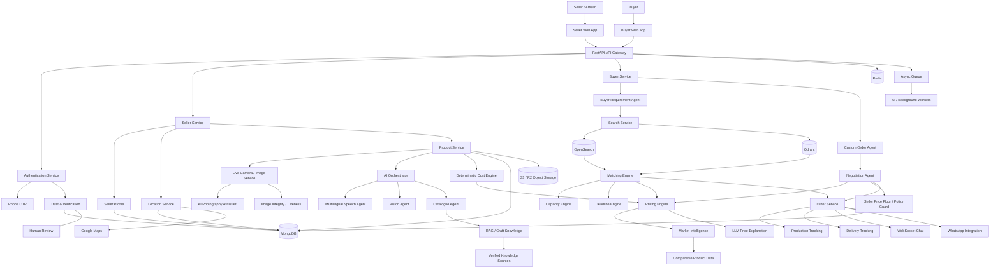

# AI Virtual Business Manager for Artisans

> An AI-powered digital commerce enablement platform that helps traditional artisans and small producers become digitally market-ready through voice-first catalogue creation, AI-assisted product photography, deterministic pricing intelligence, buyer–seller matching, negotiation, custom orders, and order coordination.

## Table of Contents

- [1. Project Overview](#1-project-overview)
- [2. Problem Statement](#2-problem-statement)
- [3. Core Idea](#3-core-idea)
- [4. Existing E-commerce vs This Platform](#4-existing-e-commerce-vs-this-platform)
- [5. Target Users](#5-target-users)
- [6. Key Features](#6-key-features)
- [7. Seller Workflow](#7-seller-workflow)
- [8. Buyer Workflow](#8-buyer-workflow)
- [9. Real-Time Scenarios](#9-real-time-scenarios)
- [10. AI and Agent Architecture](#10-ai-and-agent-architecture)
- [11. Pricing Intelligence](#11-pricing-intelligence)
- [12. Trust and Fraud Prevention](#12-trust-and-fraud-prevention)
- [13. Product Photography Assistant](#13-product-photography-assistant)
- [14. Marketplace and Multi-Artisan Orders](#14-marketplace-and-multi-artisan-orders)
- [15. System Architecture](#15-system-architecture)
- [16. Technology Stack](#16-technology-stack)
- [17. Data Architecture](#17-data-architecture)
- [18. Security and Privacy](#18-security-and-privacy)
- [19. Reliability and AI Guardrails](#19-reliability-and-ai-guardrails)
- [20. Scalability](#20-scalability)
- [21. Offline and Failure Handling](#21-offline-and-failure-handling)
- [22. API Domains](#22-api-domains)
- [23. Repository Structure](#23-repository-structure)
- [24. Development Setup](#24-development-setup)
- [25. Environment Variables](#25-environment-variables)
- [26. Testing](#26-testing)
- [27. Deployment](#27-deployment)
- [28. Monitoring](#28-monitoring)
- [29. Future Enhancements](#29-future-enhancements)
- [30. Test Cases](#30-test-cases)
- [31. Project Impact](#31-project-impact)
- [32. Project Positioning](#32-project-positioning)

---

## 1. Project Overview

Traditional artisans often have strong craftsmanship but limited access to digital commerce.

The main barrier is not the absence of products. It is the gap between:

**"I can make this product"**

and

**"I can professionally present, price, market, negotiate, and sell this product online."**

This project addresses that gap with an AI-powered web platform that acts as a **Virtual Business Manager** for artisans.

The platform helps sellers:

- Register and verify their presence.
- Capture venue, workspace, product, and process evidence using a live camera.
- Receive AI guidance for lighting, framing, blur, and image quality.
- Describe production information using voice or text.
- Generate structured product catalogues.
- Calculate production cost using deterministic formulas.
- Receive market-aware selling-price recommendations.
- Understand why a price was recommended.
- Negotiate with buyers using voice or text.
- Publish products for discovery.

Buyers can:

- Search using natural language.
- Specify quantity, budget, deadline, and requirements.
- Request customized products.
- Discover one or multiple artisans capable of fulfilling an order.
- Negotiate with sellers.
- Track production and delivery.
- Communicate through the application and supported WhatsApp notifications.

---

## 2. Problem Statement

### Challenge

There is a critical need to bridge the gap between traditional craftsmanship and modern digital commerce.

Beneficiaries struggle to present their products competitively online. They often face difficulties with:

- Capturing high-quality product images.
- Writing compelling product descriptions.
- Structuring product information.
- Understanding market pricing.
- Reaching suitable customers.
- Managing bulk/custom orders.
- Negotiating digitally.
- Handling digital commerce workflows.

The proposed system acts as an **AI-driven Virtual Business Manager** that reduces this digital barrier while keeping important business decisions under seller control.

---

## 3. Core Idea

### We are not building another Amazon, Flipkart, or Meesho.

Existing marketplaces primarily solve:

> **"Where can products be bought and sold?"**

Our system focuses on:

> **"How can an artisan who is not digitally ready become a professional digital seller?"**

### Traditional flow

```text
Artisan
   ↓
Learn digital commerce
   ↓
Take product photos
   ↓
Write descriptions
   ↓
Fill product attributes
   ↓
Understand pricing
   ↓
Create listing
   ↓
Sell
```

### Proposed flow

```text
Artisan
   ↓
Voice + Live Camera
   ↓
AI understands product
   ↓
AI assists photography
   ↓
Structured production data
   ↓
Deterministic cost calculation
   ↓
Market-aware price recommendation
   ↓
Smart catalogue
   ↓
Digital market linkage
   ↓
Buyer discovery
   ↓
Order / Negotiation
```

---

## 4. Existing E-commerce vs This Platform

Amazon, Flipkart, Meesho and other commerce platforms already provide important infrastructure such as product discovery, seller onboarding, payments, orders, logistics and customer access.

The difference is the layer being solved.

| Existing marketplace | This platform |
|---|---|
| Marketplace | Digital-commerce enablement layer |
| Seller provides product information | AI helps create product information |
| Seller takes product photos | AI guides live photography |
| Seller generally determines listing details | AI extracts structured attributes |
| Seller determines price | Deterministic pricing engine provides guidance |
| Search and transaction | Search + business intelligence + matching |
| Single seller order is common | Multi-artisan fulfilment |
| Standard product listing | Custom-order workflow |
| Digital seller assumed | Designed to reduce digital-literacy barriers |

### Positioning

```text
                     CUSTOMER
                         ▲
                         │
             ┌───────────┴───────────┐
             │                       │
          AMAZON                 FLIPKART
             │                       │
          MEESHO                 OTHER
             │                   CHANNELS
             └───────────┬───────────┘
                         ▲
                         │
                 OUR PLATFORM
                         │
          ┌──────────────┼──────────────┐
          │              │              │
       Voice AI       Vision AI     Pricing AI
          │              │              │
          └──────────────┼──────────────┘
                         │
                      ARTISAN
```

---

## 5. Target Users

### 5.1 Artisans

People who create products using traditional, manual, or specialized skills.

Examples:

- Potters
- Weavers
- Bamboo craftsmen
- Woodworkers
- Embroidery artisans
- Handicraft producers
- Jewellery makers
- Textile producers
- Rural micro-producers
- Artisan cooperatives

### 5.2 Vendors / Sellers

A seller may be:

- The artisan themselves.
- A family business.
- A cooperative.
- A self-help group.
- A rural producer group.
- A small retail business.
- An artisan aggregator.

An artisan and seller may be the same person.

### 5.3 Buyers

Potential buyers include:

- Individual customers.
- Retail businesses.
- Hotels.
- Restaurants.
- Interior designers.
- Corporate buyers.
- Event organizers.
- Wholesalers.
- B2B procurement teams.
- Institutions.

---

## 6. Key Features

### Seller

- Phone OTP registration.
- Seller profile.
- Shop/workspace information.
- Live camera capture.
- Venue evidence.
- Location capture.
- AI photography assistant.
- Product image quality assessment.
- Voice/text product input.
- Multilingual interaction.
- Structured production information.
- Smart catalogue generation.
- Deterministic cost calculation.
- Market-aware price recommendation.
- Price explanation.
- Seller-defined price floor.
- AI-assisted negotiation.
- Product publishing.
- Production capacity management.

### Buyer

- Natural-language search.
- Product requirements.
- Budget range.
- Quantity.
- Deadline.
- Purpose/context.
- Custom product requests.
- Multi-artisan order fulfilment.
- Seller matching.
- Negotiation.
- Order tracking.
- In-app chat.
- WhatsApp notifications.

### Platform

- Trust and verification.
- Duplicate-image detection.
- Fraud-risk scoring.
- Semantic search.
- Product matching.
- Capacity matching.
- Deadline feasibility.
- Market intelligence.
- Event-driven processing.
- Analytics.
- Human review for high-risk cases.

---

## 7. Seller Workflow

```text
REGISTER
   ↓
PHONE OTP
   ↓
SELLER PROFILE
   ↓
VENUE / WORKSPACE VERIFICATION
   ↓
LIVE LOCATION
   ↓
LIVE CAMERA CAPTURE
   ↓
PRODUCT INFORMATION
   ↓
AI PHOTOGRAPHY ASSISTANCE
   ↓
PRODUCTION & COST INPUT
   ↓
COST ENGINE
   ↓
MARKET DATA
   ↓
PRICING ENGINE
   ↓
AI PRICE EXPLANATION
   ↓
SELLER ACCEPTS / EDITS / NEGOTIATES
   ↓
SMART CATALOGUE
   ↓
PUBLISH
```

---

## 8. Buyer Workflow

```text
LOGIN
   ↓
NATURAL LANGUAGE SEARCH
   ↓
AI REQUIREMENT EXTRACTION
   ↓
PRODUCT / SELLER SEARCH
   ↓
SEMANTIC MATCHING
   ↓
PRICE + CAPACITY + DEADLINE FILTERING
   ↓
MATCHED SELLERS
   ↓
CUSTOMIZATION / NEGOTIATION
   ↓
ORDER
   ↓
PRODUCTION TRACKING
   ↓
DELIVERY
   ↓
COMPLETION
```

---

## 9. Real-Time Scenarios

### Scenario 1 — Bamboo Artisan

Meena produces handmade bamboo baskets.

She opens the application and says:

> "This basket is made from bamboo. It takes two days to make. I normally sell it for ₹500."

She captures the product through the live camera.

The system:

1. Checks lighting.
2. Checks blur.
3. Checks framing.
4. Extracts product information.
5. Creates a product title.
6. Generates a product description.
7. Calculates production cost.
8. Checks market information.
9. Produces a recommended selling range.
10. Publishes the catalogue after seller approval.

The artisan does not need to manually construct the complete listing.

### Scenario 2 — Handloom Weaver

Ravi produces a handwoven cotton saree.

He provides:

- Material cost.
- Labour.
- Production duration.
- Number of workers.
- Daily capacity.
- Product image.

The system calculates the unit production cost and compares it against configured market data.

The seller receives:

> **Recommended price: ₹1,900–₹2,100**

along with an explanation of the factors that produced the range.

The final decision remains with Ravi.

### Scenario 3 — Multi-Artisan Bulk Order

A hotel needs:

> **500 handmade bamboo baskets within 15 days.**

No single artisan can produce 500 units.

The system finds:

```text
Artisan A → 200
Artisan B → 150
Artisan C → 150

Total → 500
```

The platform can coordinate the order based on:

- Product compatibility.
- Capacity.
- Price.
- Deadline.
- Customization.
- Logistics.

This transforms the platform from a simple marketplace into a **distributed artisan supply network**.

---

## 10. AI and Agent Architecture

The system uses **specialized AI services/agents**, not one unrestricted autonomous agent.

```text
                         AI ORCHESTRATOR
                                │
              ┌─────────────────┼─────────────────┐
              │                 │                 │
              ▼                 ▼                 ▼
        SELLER AGENTS      BUYER AGENTS      TRUST AGENTS
              │                 │                 │
       ┌──────┼──────┐    ┌─────┼─────┐     ┌────┼─────┐
       ▼      ▼      ▼    ▼     ▼     ▼     ▼    ▼     ▼
     Photo  Voice  Catalog Req  Match Custom  Fraud Image
     Agent  Agent  Agent Agent Agent Agent   Risk  Integrity
              │                 │
              └────────┬────────┘
                       ▼
                 BUSINESS TOOLS
                       │
          ┌────────────┼────────────┐
          ▼            ▼            ▼
       Pricing      Capacity     Orders
        Engine       Engine       Engine
```

### AI Photography Agent

Responsibilities:

- Lighting assessment.
- Blur detection.
- Exposure assessment.
- Framing.
- Product positioning.
- Background quality.
- Camera distance guidance.

Real-time feedback should use lightweight computer vision instead of calling an LLM on every camera frame.

### Multilingual Voice Agent

Responsibilities:

- Speech recognition.
- Language detection.
- Translation/normalization.
- Structured information extraction.

Example:

```json
{
  "material_cost": 200,
  "production_days": 2,
  "workers": 2,
  "labour_cost_per_worker_per_day": 300,
  "max_daily_capacity": 5
}
```

### Catalogue Agent

Creates:

- Product title.
- Product description.
- Category.
- Attributes.
- Search tags.
- Multilingual content.

Generated content remains editable by the seller.

### Pricing Intelligence Engine

**Not an LLM.**

Uses:

- Material cost.
- Labour cost.
- Production duration.
- Number of workers.
- Maximum daily capacity.
- Packaging cost.
- Energy cost where relevant.
- Transportation cost where relevant.
- Seller margin.
- Comparable market prices.
- Market demand signals where available.

### Negotiation Agent

Uses an LLM plus pricing and policy tools.

Example:

Buyer:

> "I need 100 units. Can you give me ₹450 each?"

Seller price floor:

> ₹480

Because:

```text
₹450 < ₹480
```

the agent cannot automatically accept.

It may suggest:

> "The seller's current minimum is ₹480 per unit. Would you like to proceed at ₹480 for 100 units?"

### Buyer Requirement Agent

Converts:

> "I need 100 eco-friendly bamboo baskets below ₹600 for a hotel event within 12 days."

into:

```json
{
  "product": "bamboo basket",
  "quantity": 100,
  "max_price": 600,
  "deadline_days": 12,
  "material_preference": "eco-friendly",
  "purpose": "hotel event"
}
```

### Matching Agent

Matches:

- Product similarity.
- Price compatibility.
- Production capacity.
- Deadline feasibility.
- Customization capability.
- Location/logistics suitability.
- Seller reliability.

### Custom Order Agent

Converts natural-language requests into structured specifications:

- Custom size.
- Custom colour.
- Custom branding.
- Custom material.
- Custom packaging.
- Bulk quantities.

### Trust and Fraud Agent

Combines:

- Phone OTP.
- Live camera capture.
- Image integrity checks.
- Perceptual image hashes.
- Duplicate-image detection.
- Location consistency.
- Behavioural signals.

The result is a **risk score**, not an automatic accusation.

---

## 11. Pricing Intelligence

### Why an LLM must not randomly determine price

An LLM can produce plausible-looking numbers that are economically incorrect.

Therefore:

> **LLM = language/reasoning layer**

> **Pricing Engine = numerical decision layer**

### Unit Labour Cost

If:

- `W` = workers
- `L` = daily labour cost per worker
- `D` = production days
- `U` = maximum units/day

Then:

```text
Total Labour Cost = W × L × D

Total Production Capacity = U × D

Labour Cost / Unit =
(W × L × D) / (U × D)
```

If daily capacity remains constant:

```text
Labour Cost / Unit = (W × L) / U
```

### Production Cost

```text
Unit Cost =
Material Cost
+ Labour Cost / Unit
+ Packaging Cost
+ Energy Cost / Unit
+ Other Direct Costs
```

### Base Selling Price

If target margin is `M`:

```text
Base Price = Unit Cost × (1 + M)
```

Example:

```text
Unit Cost = ₹320
Target Margin = 25%

Base Price = ₹320 × 1.25
           = ₹400
```

### Market Reference

Example comparable prices:

```text
₹450
₹475
₹500
₹520
₹550
```

Median:

```text
Market Median = ₹500
```

The pricing engine combines:

```text
Cost Floor
+
Target Margin
+
Market Reference
+
Demand Signals
+
Capacity
+
Order Quantity
```

to produce a recommended range.

---

## 12. Trust and Fraud Prevention

### Seller Presence

Phone OTP verifies phone ownership, but it does not prove that someone is genuinely operating an artisan business.

The platform therefore combines:

1. Phone verification.
2. Live camera capture.
3. Venue/workspace evidence.
4. Product-making evidence.
5. Location coordinates.
6. Image integrity analysis.
7. Duplicate detection.
8. Behavioural anomaly detection.

### Five Image Capture Model

Mandatory:

1. Venue/shop/workspace.
2. Finished product.
3. Product being made.

Additional:

4. Another product/workspace image.
5. Additional supporting image.

The verification flow should use a live camera instead of a normal gallery upload.

### Risk model

```text
Low Risk
   ↓
Verified

Medium Risk
   ↓
Additional verification

High Risk
   ↓
Manual review
```

---

## 13. Product Photography Assistant

The application guides sellers before image capture.

### Detect

- Low brightness.
- Excessive brightness.
- Blur.
- Poor framing.
- Product partially outside frame.
- Excessive background clutter.
- Poor camera distance.

### Example

```text
GOOD
✓ Product centered
✓ Lighting acceptable
✓ Image sharp
✓ Product fully visible
```

or:

```text
IMPROVE
⚠ Lighting is too dark
→ Move near a window
```

The expensive vision/LLM pipeline should run after capture where possible, while lightweight CV handles real-time feedback.

---

## 14. Marketplace and Multi-Artisan Orders

A major feature is supporting orders that exceed one seller's capacity.

Example:

```text
Buyer requirement = 500 units

Seller A capacity = 200
Seller B capacity = 150
Seller C capacity = 150

Combined capacity = 500
```

The system can construct a distributed fulfilment plan.

Useful for:

- Hotels.
- Events.
- Corporate gifting.
- Retail procurement.
- Institutional orders.

---

## 15. System Architecture



---

## 16. Technology Stack

| Layer | Technology |
|---|---|
| Web | Next.js + React + TypeScript |
| UI | Tailwind CSS + shadcn/ui |
| Backend | Python + FastAPI |
| Primary Database | MongoDB |
| Cache | Redis |
| Search | OpenSearch |
| Vector Search | Qdrant |
| Object Storage | S3-compatible storage / Cloudflare R2 |
| Background Jobs | Redis + Celery |
| LLM | Qwen 3 / Qwen 2.5 class instruct model |
| LLM Serving | vLLM |
| Local AI Development | Ollama |
| Speech | Whisper + Indic ASR evaluation |
| Translation | NLLB / Indic language models |
| Computer Vision | OpenCV + YOLO + Vision-Language Models |
| Pricing | Python deterministic engine |
| Matching | OpenSearch + Qdrant + ranking engine |
| Authentication | JWT + Phone OTP |
| Realtime | WebSockets |
| Maps | Google Maps |
| Messaging | WhatsApp Business API |
| Monitoring | Prometheus + Grafana |
| Error Tracking | Sentry |
| Containers | Docker |
| CI/CD | GitHub Actions |
| Deployment | Docker initially, Kubernetes for larger deployment |

---

## 17. Data Architecture

### MongoDB

MongoDB is selected because product information is heterogeneous.

Different crafts have different attributes.

Example:

```json
{
  "product_type": "bamboo_basket",
  "material": "bamboo",
  "dimensions": {
    "height": 30,
    "width": 25
  },
  "craft": "handwoven"
}
```

A saree may instead contain:

```json
{
  "product_type": "handloom_saree",
  "material": "cotton",
  "length": "6m",
  "weave": "handloom"
}
```

### Recommended Collections

```text
users
sellers
buyers
seller_verifications
products
catalogues
product_media
production_profiles
pricing_records
market_data
orders
order_items
negotiations
conversations
messages
notifications
trust_events
fraud_flags
locations
ai_interactions
audit_logs
```

### Search

MongoDB remains the system of record.

OpenSearch handles large-scale discovery.

Qdrant handles semantic similarity.

```text
Buyer Query
    ↓
Requirement Agent
    ↓
Structured Filters
    ↓
OpenSearch
    ↓
Semantic Search
    ↓
Qdrant
    ↓
Candidate Sellers
    ↓
Capacity / Deadline / Price
    ↓
Matching Engine
    ↓
Ranked Results
```

### Media

Large images should not be stored directly inside MongoDB.

Use object storage:

```text
Browser
   ↓
Upload Service
   ↓
Object Storage
   ↓
CDN
   ↓
Buyer / Seller
```

MongoDB stores media metadata and references.

---

## 18. Security and Privacy

### Authentication

- Phone OTP.
- JWT access tokens.
- Refresh tokens.
- Session expiry.
- Rate limiting.

### Seller verification

- OTP.
- Live camera.
- Image integrity.
- Location.
- Risk scoring.

### Data security

- HTTPS/TLS.
- Encryption at rest where supported.
- Secure secrets management.
- Role-based access control.
- Audit logs.
- Input validation.
- API rate limiting.

### Location privacy

The application only collects location required for the stated seller-location functionality.

Stored coordinates are used to:

- Associate the seller/workspace with a location.
- Redirect buyers to the map location.

Continuous location tracking is not required.

---

## 19. Reliability and AI Guardrails

The architecture deliberately separates AI from critical business logic.

### Deterministic systems

Use deterministic code for:

- Cost calculations.
- Price floors.
- Capacity.
- Quantity.
- Deadline checks.
- Authentication.
- Order state transitions.
- Financial calculations.

### AI systems

Use AI for:

- Voice understanding.
- Translation.
- Image interpretation.
- Description generation.
- Buyer requirement extraction.
- Negotiation.
- Explanations.
- Semantic matching.

### Core principle

```text
AI proposes
      ↓
Business rules validate
      ↓
User approves
      ↓
System executes
```

### If AI is wrong

If AI extracts:

```text
Material = bamboo
```

with low confidence, the system should ask:

> "Is the product made from bamboo?"

### Confidence policy

```text
High confidence
    ↓
Auto-fill

Medium confidence
    ↓
Show suggestion

Low confidence
    ↓
Ask user
```

For financial decisions, AI cannot bypass deterministic pricing constraints.

For negotiation, AI cannot accept below the seller's configured minimum.

---

## 20. Scalability

The platform should use stateless APIs and independently scalable services.

### Horizontal scaling

```text
                Load Balancer
                     │
          ┌──────────┼──────────┐
          ▼          ▼          ▼
       API #1      API #2      API #3
```

### Async AI processing

```text
User Upload
    ↓
Fast API Response
    ↓
Queue
    ↓
AI Worker
    ↓
Result
    ↓
Database
```

### Caching

Redis can cache:

- Popular products.
- Search results.
- Seller profiles.
- Frequently requested market data.
- Session information.

### Independent AI scaling

```text
Heavy image traffic
       ↓
Scale vision workers

Heavy search traffic
       ↓
Scale search service

Heavy LLM traffic
       ↓
Scale LLM inference workers
```

---

## 21. Offline and Failure Handling

Even though the product is web-based, graceful degradation is important.

### Network failure

Draft:

- Product details.
- Text.
- Captured media metadata.

can be retained client-side and synchronized when connectivity returns.

### AI service failure

The product should not disappear.

The system can show:

> "AI processing is temporarily unavailable. Your product has been saved and will be processed when the service is available."

### Database failure

Use:

- Automated backups.
- Replica strategy.
- Recovery procedures.

### Object-storage failure

Use durable storage and retry mechanisms.

### Device failure

The seller's business profile and catalogue remain server-side and can be restored after authentication on another device.

---

## 22. API Domains

Suggested API boundaries:

```text
/api/v1/auth
/api/v1/users
/api/v1/sellers
/api/v1/buyers
/api/v1/products
/api/v1/catalogues
/api/v1/media
/api/v1/pricing
/api/v1/market
/api/v1/search
/api/v1/matching
/api/v1/orders
/api/v1/negotiations
/api/v1/chat
/api/v1/notifications
/api/v1/trust
/api/v1/verification
/api/v1/location
/api/v1/ai
```

---

## 23. Repository Structure

```text
artisan-commerce/
│
├── frontend/
│   ├── app/
│   ├── components/
│   ├── features/
│   ├── hooks/
│   ├── services/
│   ├── types/
│   └── utils/
│
├── backend/
│   ├── app/
│   │   ├── api/
│   │   ├── core/
│   │   ├── models/
│   │   ├── schemas/
│   │   ├── services/
│   │   ├── repositories/
│   │   └── main.py
│   ├── tests/
│   └── requirements.txt
│
├── ai/
│   ├── orchestrator/
│   ├── speech/
│   ├── translation/
│   ├── vision/
│   ├── catalogue/
│   ├── pricing/
│   ├── matching/
│   ├── negotiation/
│   └── fraud/
│
├── workers/
│   ├── image_tasks/
│   ├── speech_tasks/
│   ├── catalogue_tasks/
│   └── embedding_tasks/
│
├── infrastructure/
│   ├── docker/
│   ├── nginx/
│   ├── monitoring/
│   └── deployment/
│
├── docs/
│   ├── architecture/
│   ├── api/
│   ├── ai/
│   ├── security/
│   └── decisions/
│
├── docker-compose.yml
├── .env.example
├── README.md
└── LICENSE
```

---

## 24. Development Setup

### Prerequisites

- Node.js 20+
- Python 3.11+
- MongoDB
- Redis
- Docker
- Git
- Optional GPU for local AI development

### Clone

```bash
git clone <repository-url>
cd artisan-commerce
```

### Frontend

```bash
cd frontend
npm install
npm run dev
```

### Backend

```bash
cd backend

python -m venv .venv

# Windows
.venv\Scripts\activate

# Linux/macOS
source .venv/bin/activate

pip install -r requirements.txt

uvicorn app.main:app --reload
```

### Infrastructure

```bash
docker compose up -d
```

Recommended local services:

```text
MongoDB
Redis
OpenSearch
Qdrant
MinIO
```

---

## 25. Environment Variables

Example:

```env
APP_ENV=development
APP_NAME=artisan-commerce
SECRET_KEY=change-me

MONGODB_URI=mongodb://localhost:27017
MONGODB_DATABASE=artisan_commerce

REDIS_URL=redis://localhost:6379

OPENSEARCH_URL=http://localhost:9200

QDRANT_URL=http://localhost:6333

S3_ENDPOINT=http://localhost:9000
S3_ACCESS_KEY=change-me
S3_SECRET_KEY=change-me
S3_BUCKET=artisan-media

JWT_SECRET=change-me

OTP_PROVIDER=
OTP_API_KEY=

LLM_BASE_URL=
LLM_MODEL=

GOOGLE_MAPS_API_KEY=

WHATSAPP_API_URL=
WHATSAPP_ACCESS_TOKEN=

SENTRY_DSN=
```

Never commit real secrets to GitHub.

---

## 26. Testing

### Unit Tests

Test:

- Cost calculation.
- Labour calculation.
- Capacity calculation.
- Price floor.
- Price recommendation.
- Order totals.
- Matching scores.

### Integration Tests

Test:

- Registration → OTP.
- Seller → Product creation.
- Product → Pricing.
- Buyer → Search.
- Search → Matching.
- Matching → Order.
- Order → Notification.

### AI Evaluation

Evaluate:

- Speech transcription accuracy.
- Multilingual extraction.
- Product attribute extraction.
- Catalogue correctness.
- Image quality assessment.
- Semantic matching.
- Negotiation safety.

### Security Testing

Test:

- OTP abuse.
- Rate limiting.
- Duplicate accounts.
- Malicious image uploads.
- Injection attacks.
- Unauthorized order access.
- Unauthorized seller-data access.

---

## 27. Deployment

### Development

```text
Docker Compose
├── Frontend
├── FastAPI
├── MongoDB
├── Redis
├── OpenSearch
├── Qdrant
└── MinIO
```

### Production

A scalable deployment can use:

```text
CDN
 ↓
Load Balancer
 ↓
Next.js
 ↓
API Gateway
 ↓
Microservices
 ↓
MongoDB Cluster
Redis Cluster
OpenSearch Cluster
Qdrant
Object Storage
AI Inference Workers
```

For larger deployments, Kubernetes can orchestrate independently scalable services.

---

## 28. Monitoring

Recommended observability stack:

### Metrics

**Prometheus**

Track:

- API latency.
- Request count.
- Queue depth.
- AI processing time.
- Error rate.
- Search latency.
- Order processing latency.

### Dashboards

**Grafana**

### Error tracking

**Sentry**

### AI monitoring

Track:

- AI confidence.
- Human corrections.
- Failed extraction.
- Pricing overrides.
- Negotiation rejection.
- Fraud false positives.
- Model latency.

---

## 29. Future Enhancements

Potential future additions:

- Advanced demand forecasting.
- Regional price forecasting.
- Seller performance analytics.
- Automated inventory prediction.
- Procurement suggestions.
- Logistics optimization.
- Cross-border commerce support.
- Export documentation assistance.
- Digital certificates of authenticity.
- Craft provenance records.
- Advanced recommendation systems.
- Government program integration.
- Cooperative-level analytics.
- ML-based fraud risk scoring.
- Personalized business coaching.

---

## 30. Test Cases

### Test Case 1 — Voice-to-Catalogue

#### Input

Seller says:

> "This is a handmade bamboo basket. It takes two days to make. Bamboo costs around ₹200 and I sell it for ₹500."

#### Expected

```text
Product = Handmade Bamboo Basket
Material = Bamboo
Production Time = 2 days
Material Cost = ₹200
Seller Price = ₹500
Category = Bamboo Handicraft
```

The catalogue should be generated and remain editable.

---

### Test Case 2 — Multilingual Input

#### Input

Tamil voice:

> "இந்த கூடை மூங்கில் கொண்டு செய்தது. இதை செய்ய இரண்டு நாட்கள் ஆகும். விலை 500 ரூபாய்."

#### Expected

```text
Language detected = Tamil

Material = Bamboo
Production Time = 2 days
Price = ₹500
Category = Bamboo Handicraft
```

The system should generate a marketplace-ready catalogue without requiring English typing.

---

## 31. Project Impact

### Economic Impact

- Improves digital visibility of artisans.
- Helps sellers understand production economics.
- Enables access to larger markets.
- Supports bulk orders.
- Reduces catalogue creation effort.

### Social Impact

- Reduces digital-literacy barriers.
- Supports regional-language interaction.
- Preserves traditional craftsmanship.
- Gives small producers better access to digital commerce.

### Government / Ecosystem Impact

The system can act as a digital enablement layer for:

- Artisan development programs.
- Cooperatives.
- SHGs.
- Rural producer groups.
- Government-supported marketplaces.
- Existing commerce networks.

The platform does not need to replace existing marketplaces.

---

## 32. Project Positioning

### Core differentiator

> **Existing marketplaces digitize commerce. Our platform digitizes the artisan for commerce.**

The platform is not simply:

- A chatbot.
- A product catalogue generator.
- A marketplace.
- A pricing calculator.
- A fraud detector.

It combines these capabilities into a controlled commerce workflow.

### AI + Deterministic Architecture

```text
                 ARTISAN
                    │
              Voice / Image
                    │
                    ▼
             AI PERCEPTION
                    │
          ┌─────────┼─────────┐
          ▼         ▼         ▼
       Speech     Vision    Language
          │         │         │
          └─────────┼─────────┘
                    ▼
             STRUCTURED DATA
                    │
       ┌────────────┼────────────┐
       ▼            ▼            ▼
    Pricing      Capacity      Matching
    Engine        Engine        Engine
       │            │            │
       └────────────┼────────────┘
                    ▼
              BUSINESS RULES
                    │
                    ▼
             LLM EXPLANATION
                    │
                    ▼
              HUMAN APPROVAL
                    │
                    ▼
                 ACTION
```

### Core principle

> **Use AI where language, perception, and ambiguity exist. Use deterministic software where correctness and financial constraints matter.**

---

## Project Summary

### One-line

> **An AI-powered Virtual Business Manager that transforms an artisan's voice, product images, production data, and business requirements into a professional digital commerce presence with intelligent pricing, buyer matching, negotiation, and order coordination.**

### Technical

> **A scalable AI-commerce platform combining multimodal AI, deterministic financial/business engines, semantic search, vector retrieval, trust scoring, event-driven processing, and human-in-the-loop controls to digitally enable traditional artisans.**

### Judge-friendly

> **"An artisan should not have to become a digital expert to sell digitally."**

---

## License

Choose an appropriate open-source or proprietary license before public release.

Example:

```text
MIT License
```
